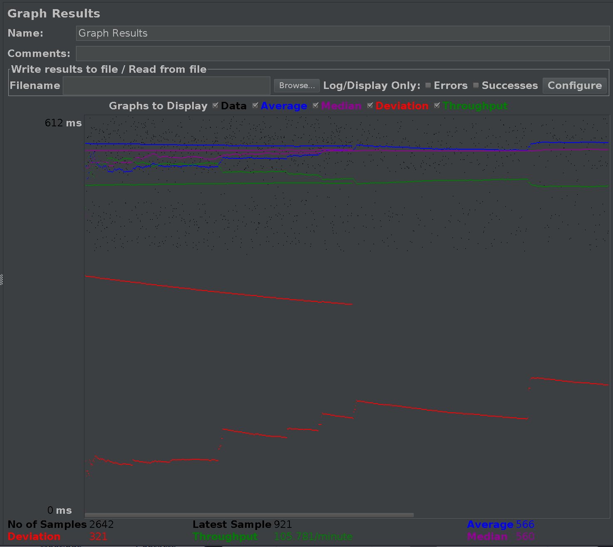

# cs122b-spring20-team-111
cs122b-spring20-111 created by GitHub Classroom

Group project

# TOC

- [cs122b-spring20-team-111](#cs122b-spring20-team-111)
- [TOC](#toc)
- [Demo video](#demo-video)
    - [project 1](#project-1)
    - [project 2](#project-2)
    - [project 3](#project-3)
    - [project 4](#project-4)
    - [project 5](#project-5)
- [Deployment](#deployment)
    - [Android](#android)
- [Connection Pooling](#connection-pooling)
            - [Explain how Connection Pooling is utilized in the Fabflix code.](#explain-how-connection-pooling-is-utilized-in-the-fabflix-code)
            - [Explain how Connection Pooling works with two backend SQL.](#explain-how-connection-pooling-works-with-two-backend-sql)
- [Master/Slave](#masterslave)
            - [How read/write requests were routed to Master/Slave SQL?](#how-readwrite-requests-were-routed-to-masterslave-sql)
- [JMeter TS/TJ Time Logs](#jmeter-tstj-time-logs)
            - [Instructions of how to use the `log_processing.*` script to process the JMeter logs.](#instructions-of-how-to-use-the-log_processing-script-to-process-the-jmeter-logs)
- [JMeter TS/TJ Time Measurement Report](#jmeter-tstj-time-measurement-report)
- [Substring Matching Design](#substring-matching-design)
- [PrepareStatement](#preparestatement)
- [XML Parser](#xml-parser)
    - [inconsistent data](#inconsistent-data)
    - [Performance Optimization](#performance-optimization)
- [Fuzzy Search](#fuzzy-search)
- [Contribution](#contribution)
    - [Jiahsu Xu, 85356927](#jiahsu-xu-85356927)
        - [project 1](#project-1-1)
        - [project 2](#project-2-1)
        - [project 3](#project-3-1)
        - [project 4](#project-4-1)
        - [project 5](#project-5-1)
    - [Haonan Xu, 55334990](#haonan-xu-55334990)
        - [project 1](#project-1-2)
        - [project 2](#project-2-2)
        - [project 3](#project-3-2)
        - [project 4](#project-4-2)
        - [project 5](#project-5-2)

# Demo video

## project 1
https://www.youtube.com/watch?v=NisNSgXC9E4&feature=youtu.be

## project 2
https://www.youtube.com/watch?v=MmDhCfUnHaA&feature=youtu.be

## project 3
https://www.youtube.com/watch?v=nAV6ZIwtfhw&feature=youtu.be

## project 4
https://www.youtube.com/watch?v=LPO8FTz89dw&feature=youtu.be

## project 5
https://www.youtube.com/watch?v=H1nXvzlUa7s&feature=youtu.be

# Deployment

For frontend, we use jQuery, Bootstrap, and Vue.js in our project.

We use `webpack` to bundle those packages.

First

```sh
git clone https://github.com/UCI-Chenli-teaching/cs122b-spring20-team-111.git

cd cs122b-spring20-team-111
```

clone to our project to local disk and cd into it.

Then make sure you have latest npm and node.js installed.

If not, in ubuntu

```sh
sudo apt install npm

sudo npm install -g n

sudo n stable
```

Then

```npm
npm i

npm run build
```

which will install the packages as listed in `packages.json` and use
`webpack` to bundle packages.

Finally building up war file by

```
mvn clean package
```

Copy war file to tomcat webapps and start tomcat (assuming your tomcat is
installed in ~/tomcat and enable autodeploy.)

```
cp ./target/cs122B.war ~/tomcat/webapps/

~/tomcat/bin/catalina.sh start
```

Then go to https://localhost:8443 (default) and login manager page, you
should see the `cs122b` project. Click it and you are ready to go!

## Android

First create a `local.properties` that contains the Android SDK location.
Next run `./gradlew build`.

If you want to build an apk, then run

```bash
./gradlew assembleDebug
```

and the apk would be located in
`app/build/outpus/apk/debug/app-debug.apk`.

# Connection Pooling

The filename in which we use JDBC Connection Pooling is listed below (all
in `scaledFablix/src` folder), for the prepare Statement files, see the
section below. For non-pooling version of Fablix, see `nopool` branch.

- AllGenres
- AutoComplete
- Confirm (write)
- DashBoard (Write)
- EmployeeLogin
- Login
- MovieList
- Payment
- SingleMovie
- SingleStar

#### Explain how Connection Pooling is utilized in the Fabflix code.
We defined JNDI DataSource in Tomcat by decalrating resource in `web/META-INF/context.xml`. Then in the Servlet code we use annotation
```java
@Resource(name = "jdbc/moviedb")
private DataSource dataSource;
try {
	Connection dbcon = dataSource.getConnection();
	...
}
```
, which is a syntax sugar of
```java
Context initContext = new InitialContext();
Context envContext = (Context) initContext.lookup("java:/comp/env");
DataSource ds = (DataSource) envContext.lookup("jdbc/moviedb");
Connection dbcon = ds.getConnection();
```

#### Explain how Connection Pooling works with two backend SQL.
We create two dataSource in `context.xml`. 

- The master dataSource, with url linked to the master's private ip. In this way if the slave is handling the session and the user tried to send a write request, it would be sent to master and therefore the writing part would only be executed by the master (As slave is also an AWS instance, through private IP it would find the master).
- The localhost dataSource, with url linked to localhost's 3306 port. The load balancer would direct requests to either master or slave. Whoever receives the request would pull up the information form its own database.


# Master/Slave

The path of configuration files is
`scaledFablix/web/META-INF/context.xml`, where we defined two data
sources:
- localhost
- AWS master instance's private ip

The data source are registered in `scaledFablix/web/WEB-INF/web.xml`.

#### How read/write requests were routed to Master/Slave SQL?

Whenever we read we would just use the data source that connected to the
localhost. When the load balancer sends the request to instance, master or
slave, the instance would just use its own db to fetch the data.

On the other hand, if there is a write operation like payment or employee
add movie, we would use the master's datasource and send query to master
instead, and through that we maintain the data consistency between master
and slave.

# JMeter TS/TJ Time Logs

#### Instructions of how to use the `log_processing.*` script to process the JMeter logs.
We create a python file `log_processing.py` on the root of the project. To use it, either
```python
python log_processing.py -s <file>
```
to parse and calculate TS and TJ for a single file; or
```python
python log_processing.py <dir>
```
to parse and calculate TS and TJ for all files in the target directory.


# JMeter TS/TJ Time Measurement Report

|     **Single-instance Version Test Plan**     |   **Graph Results Screenshot**    | **Average Query Time(ms)** | **Average Search Servlet Time(ms)** | **Average JDBC Time(ms)** |                         **Analysis**                         |
| :-------------------------------------------: | :-------------------------------: | :------------------------: | :---------------------------------: | :-----------------------: | :----------------------------------------------------------: |
|             Case 1: HTTP/1 thread             |         |            778             |               234.63                |          233.93           | One thread is not a huge load for instance so it's query time is not far away from the Servlet time. But still the average is going up since the machine is under stress |
|            Case 2: HTTP/10 threads            |        |            2056            |               235.72                |          235.27           | Given ten threads' stress the machine, even though the Servlet time doesn't go up a lot, the query time increase dramatically, indicating that the stress of machine would influence the website's performance. |
|           Case 3: HTTPS/10 threads            |  |            1962            |               138.57                |          138.33           | Since every HTTP request would be redirected to HTTPS request, thus it has a minor speed up to send HTTPS request directly compared to sending HTTP request. |
| Case 4: HTTP/10 threads/No connection pooling |      |            2353            |               157.16                |          156.81           | Without pre-allocating connections for reuse, the server has to generate connections whenever it receives the requests, thus the query time increases, and notice that the difference of Servlet time and JDBC time increases. |


|         **Scaled Version Test Plan**          | **Graph Results Screenshot** | **Average Query Time(ms)** | **Average Search Servlet Time(ms)** | **Average JDBC Time(ms)** |                         **Analysis**                         |
| :-------------------------------------------: | :--------------------------: | :------------------------: | :---------------------------------: | :-----------------------: | :----------------------------------------------------------: |
|             Case 1: HTTP/1 thread             |     |            566             |              378.2277               |          377.49           | One thread is not a huge load for instance so it's query time is not far away from the Servlet time. Notice that it is less than single instance since Load Balancer would distribute requests to two instances instead of one. |
|            Case 2: HTTP/10 threads            |    |            1799            |               368.78                |          368.393          | Given ten threads' stress the machine, even though the Servlet time doesn't go up a lot, the query time increase dramatically, indicating that the stress of machine would influence the website's performance. Notice that it is less than single instance since Load Balancer would distribute requests to two instances instead of one. |
| Case 3: HTTP/10 threads/No connection pooling |  |            1825            |               371.48                |          369.81           | Without pre-allocating connections for reuse, the server has to generate connections whenever it receives the requests, thus the query time increases, and notice that the difference of Servlet time and JDBC time increases. Notice that it is less than single instance since Load Balancer would distribute requests to two instances instead of one. |

Note: all units in the table above are ms. The images is in `img` folder, while the logs are in `logs` folder.

# Substring Matching Design

For substring search we use

```mysql
column like '%<condition>%'
```

for example, for the `title` column

```mysql
title like '%term%'
```

since mysql is case insensitive, we don't need to take case into
consideration.

Also, for the "begin with *" search, we use the regular expression.

```mysql
where title regexp '^[^0-9a-z]'
```

# PrepareStatement

In this project we use prepared statements to guard against SQL injection. The files useing prepared statements are all in src folder and are listed below

- AutoComplete
- Confirm
- EmployeeLogin
- Login
- MovieList
- Payment
- SingleStar
- SingleMovie


# XML Parser

First cd into `parser` folder and copy the xml files here.

```sh
cp -r ~/xmls/ .
```

Then run

```sh
mvn package

mvn exec:java -Dexec.cleanupDaemonThreads=false -Dexec.mainClass="XMLParser"
```

After updating there is one `parse-log.txt` file in the folder, you can
thus view the inconsistent data.

## inconsistent data

this report consists of 3 parts, (by order ) main.xml, actor.xml,
cast.xml.

1. main.xml

By definition of movie in the moviedb, title/ year/ director and category
are all required. Thus for main.xml, if there are movie without title/
year/ director or category, the movies failed such requirement would be
recorded and considered inconsistent.

The format for this part is
```
[no dirname | no film title/ year/ cat tag / no cat in film <filmid>]
```

On the other hand if the movie does exist in the moivedb I would just accept them.

Note there are many category that has a typo or inconsistent with the
docmunetation in the
[website](http://infolab.stanford.edu/pub/movies/doc.html#CATS), for
example, the SciF and ScFi is both sci-fi. I tried to handle all
categories. but there are still many categories that I failed to
understand like BioPx. Therefore I choose to ignore some categories. For
the genres that I choose to discard please see the parse-log.txt.

The format for this part is
```
unrecognizable cat <catcode>
```

2. actor.xml

for actor.xml, if no dob is presented, I would put null as dob.

I use stagename as name of stars since I believe this is how people menmorize them.

During the parsing I checked if actor already exist in db (i.e. has same
name & dob), if does, I would reuse the db ones and not adding into stars
again. I record them in the log.

```
found same actor with dob <dob>, <stagename>
```

3. cast.xml

there is some directors that only appear in the cast.xml. Although there are infomation about their movies, these movies lack year/ genre, so I discard them.
```
directors with no movie info (id = <dirid> is=<is>)
```

Also there is some actor with stage name 's a' (some actors) I choose to discard them.
```
no clear star name (<star>) in movie title
```

if a movie has no star, i discard it.

there might be some stars that already exist in db. But since we don't know its dob, we can't really check if they are the same person, therefore for sake of safety, if they already appears in the actors, then I treat them as the same actors; if not, I would treat them as a new actor (even if
        there are people with the same name in the db already.)

The output also generate csvs in directory `./csvs`, it is used to load data into the moivedb.

## Performance Optimization

In this project we are using dom xml parser.

Our first approach is to parse xml files first, and insert movie by a series of insert statements.
Then add stars, after that do sql statement to remove already exist ones (this is really time inefficient because of star table is huge). Finally we add casts data since it embodies the relation between previous two tables. And it need them to successfully added. But this approach is slow. We realize that inserting record by record would take a large aount of time, which is inefficient.


1. But we still do need to check if the movie/ star are already in the database. The first method we came up with is to use HashMap in memory. We first extract database infomation into memory and store them into the hashmap data structure. For instance, we have a hashmap for stars table, with id be name and value be list of dobs. In this way we can check if stars from xml has the same name and dob.

2. mysql `data load infile`, we preprocess the data table by table and output each data into separate tables that corespond to our moviedb tables. I use csv format with separtor |. The reason for this is that sometimes movie would have commma inside, thus using | is much better than comma.

Combined with these two strategies we successfully reduce the parse time form 15 minutes to less than 1 minute.

# Fuzzy Search

For the fuzzy search feature, we use the ed function provided by professor
[Chen Li](http://flamingo.ics.uci.edu/toolkit/).

We also provided the compiled shared objects in the folder toolkit, and to
use function

```sh
cd toolkit

sudo cp libed*.so /usr/lib/mysql/plugin/

./test.sh
```

Note that `test.sh` also create the function for you.

Our strategy is, when user's input is less than 6 characters, we allow for
1 typo; while the input is less than 9, we allow for 2 typos, and
otherwise we are more tolerant and allow for 3 typos.

If user inputs more than one words, for example `A B` it would check `edrec(A,
        target)` than `edrec(B, target)` and found the one that matches.


We apply Fuzzy Search logic to autocomplete, movie title, director and
movie star.

We use professor's `edrec` function to build up our fuzzy searcher, which
looks like this

```
column like '%input%' or edSubstr(input, column)
```

where `edSubstr` would check the edit distance of input and column using
the strategy mentioned above.

In this way, movies like `Ashita ga aru sa: The movie` would be specified
by either `Ashita` (substring matching) or `Ashia` (edit distance 1 with
one of title's substr).

In demo we showed that

- In searching `inpossible` with director `grimald` and star `Carlo
  Cecchi` would get movie `An Impossible Crime`
- In searching `inpossible` with autocompelete search bar we could get
  movie `An Impossible Crime`
- In Android application when searching `inpossible` we can get the movie
  `An Impossible Crime`


Note: For movie `An Impossible Crime`, if user types `inpossib` it won't
match, since

1. it doesn't satisfy the `like` condition, there are no movie that
   contains word `inpossib`
2. it doesn't satisfy the `ed` condition, since the word `inpossib` has
   edit distance 3 with word `impossible`

However, when user keeps typing till `inpossibl`, it would match the correct
movie.


# Contribution

## Jiahsu Xu, 85356927

### project 1
- Single Star page & its servlet & its jump hyperlink to other pages

- Using Bootstrap beautify including collapsible button in Movie List
  page, tv-style cursor when hovering on movie links and nav-bar

- Rating based emoji using vue.js (Since we only have top 20 rated movie,
  most of the movie are smiley faces)

### project 2
- movie list page & login page & logout page & main page

- use Vue.js to manage frontend and beautify webpages with bootstrap.

### project 3
- naive xml parser

- optimized with HashMap & load data

- prepareStatement

### project 4

- autocomplete

- fuzzy search

- few Android material design

### project 5

- Jmeter

## Haonan Xu, 55334990

### project 1
- Single movie page & movieList page & singlemovie servlet & movielist servlet

- add backMovie list button to all pages.

### project 2

- cart page & confirm page & payment page &add to cart servelet

### project 3
- dashboard page and servelet

- add movie sql procedure

- employee login

### project 4
- Android App login page

- Android App main page

- Android App single movie page

### project 5
- set up aws instances


